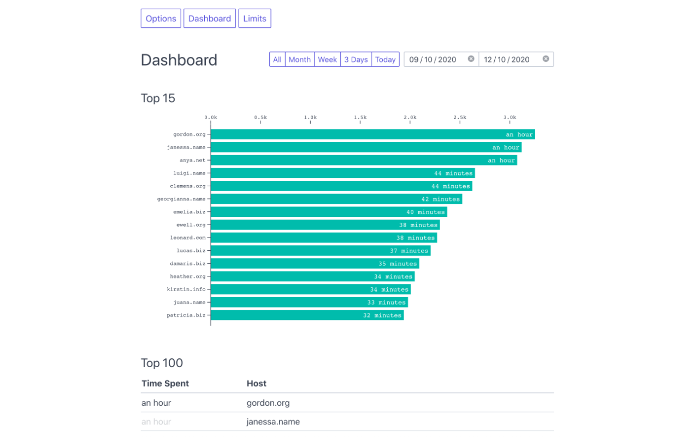
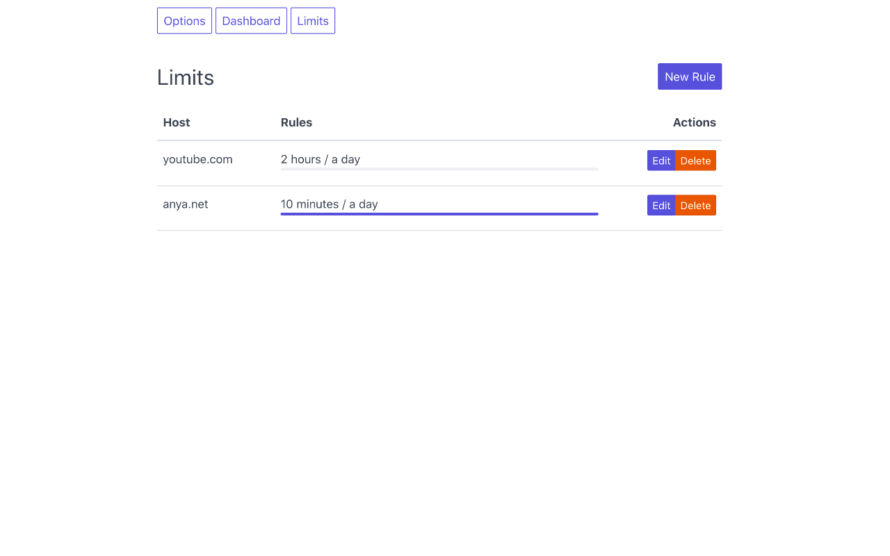
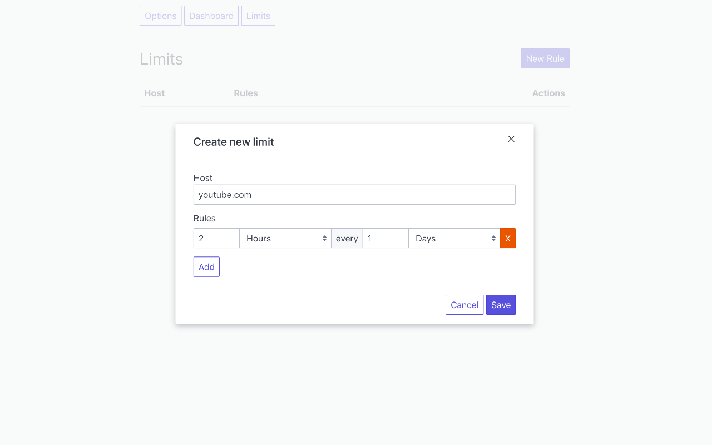

  

# Ora

Work in progress. Come back soon for more 🚀

## 🌈 Features

- Simple Dashboard
- Set limits for each host
- Powerful & flexible rules
- Import & Export data
- 100% Open Source & Local
- Set retention policy that deletes all logs older than a user specified number of days.

## 🤔 Motivation

I wanted to see how much time I was spending on each website and set limits for certain ones.
Unfortunately I only found paid solutions, or some that were not very estetically pleasing.

## Screenshots

Dashboard

Limits

Rules Editor

## Credits

Icons made by <a href="https://www.flaticon.com/authors/pixel-perfect" title="Pixel perfect">Pixel perfect</a> from <a href="https://www.flaticon.com/" title="Flaticon">www.flaticon.com</a>

